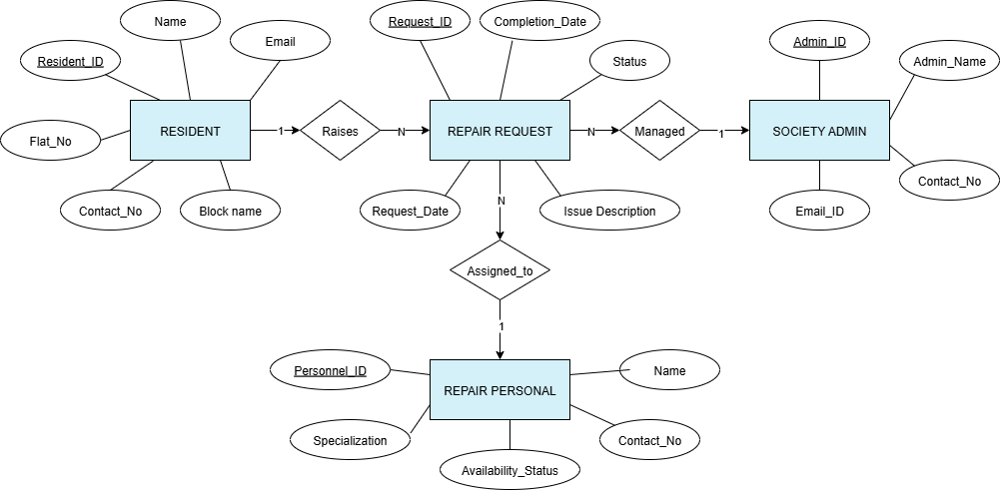

# ServiceTrack
#### Video Demo:  <https://youtu.be/PbqJTUrMTcc>
## Description 

 **ServiceTrack** is a full-stack web application built to manage repair and maintenance complaints in a residential society. In many housing societies, residents usually report issues through phone calls or informal messages, which makes tracking difficult and often leads to delays. This project solves that problem by providing a centralized digital platform where complaints can be created, tracked, assigned, and resolved in a structured way.

##  Tech Overview

The application is built using **Flask**, **MySQL**, **HTML**, **CSS**, and **JavaScript**. The main focus of this project is on **backend logic, database design, and real-world workflow handling**, rather than visual complexity. This project was developed as the **CS50 Final Project** and demonstrates core computer science concepts such as abstraction, data modeling, and system design.

---

## Users and Roles

The system supports two main user roles:

### Resident
- Can log in and raise repair requests  
- Can view all their submitted requests  
- Can track request status updates  

### Admin
- Can view all repair requests in the society  
- Can add and manage repair personnel  
- Can assign personnel to requests  
- Can update request status (Pending → Assigned → In Progress → Completed)  

Repair personnel do not have a separate login in the current version. They are fully managed by the admin. This design choice was made intentionally to keep the project scope controlled and avoid unnecessary complexity.

---

## Application Workflow

1. A resident logs in and submits a repair request with an issue description.
2. The request is stored in the database with status **Pending**.
3. An admin views the request and assigns a repair personnel.
4. The request status changes to **Assigned**, and the personnel becomes unavailable.
5. The admin marks the request **In Progress** and later **Completed**.
6. Once completed, the assigned personnel is automatically marked available again.

This workflow closely models how real maintenance systems operate in residential societies.

---

##  Database Design

The application uses a **MySQL relational database** with four main tables:

- **resident** – stores resident profile and login information  
- **society_admin** – stores admin accounts  
- **repair_personnel** – stores maintenance staff details and availability  
- **repair_request** – stores repair complaints and their lifecycle  

Foreign keys are used to maintain relationships between tables. Each repair request is linked to a resident and optionally to a repair personnel.

The `Is_Available` field in the `repair_personnel` table plays an important role. When a personnel member is assigned to a request, they are marked unavailable. Once the request is completed, they are automatically marked available again. This prevents multiple active assignments for the same worker.

---

##  ER Diagram (Database Relationships)

The following ER diagram shows the relationships between residents, repair requests, and repair personnel:

> **Note:** This diagram visually represents foreign key relationships and data flow between tables.

---

## Workflow Diagram 

The diagram below shows the lifecycle of a repair request from creation to completion:

This diagram helps explain how request status and personnel availability change during the process.

---

##  Project Structure

The project follows a modular structure for clarity and maintainability:

- **app.py**  
  Creates the Flask app, registers blueprints, initializes the database, and runs the server.

- **config.py**  
  Loads configuration values such as database credentials and secret keys from environment variables.

- **db/**  
  - `db.py`: All database queries and logic  
  - `utils.py`: Password hashing utility  
  - `__init__.py`: Database initialization  

- **routes/**  
  - `auth.py`: Login and logout logic  
  - `resident.py`: Resident-specific APIs  
  - `admin.py`: Admin-specific APIs  
  - `pages.py`: Page routing and access checks  

- **templates/**  
  Contains HTML templates for residents and admins.

- **static/**  
  Contains CSS for styling and JavaScript for frontend interaction.

---
##  Security Considerations

- Passwords are stored using hashing, not plain text  
- Flask sessions are protected using a secret key  
- Role-based checks restrict access to dashboards  
- Sensitive credentials are stored in a `.env` file and not committed to GitHub  

---

##  Design Choices

- Flask was chosen for its simplicity and flexibility  
- MySQL was used due to structured relational data  
- Vanilla JavaScript was used to avoid unnecessary frameworks  
- Personnel login was kept as **future scope** to avoid scope expansion  

These decisions helped maintain balance between realism and manageable complexity.

---

## Future Improvements

- Separate login for repair personnel  
- Email or SMS notifications  
- Improved UI/UX and mobile responsiveness  
- Cloud deployment (Render or Railway)  
These improvements can be added without changing the core architecture, demonstrating the scalability of the current design.
---

## Conclusion
ServiceTrack demonstrates a complete, non-trivial web application with meaningful backend logic, relational database design, and real-world workflow modeling. This project fulfills the CS50 Final Project requirements by showcasing problem-solving skills, abstraction, and system design rather than focusing only on visual appearance.
